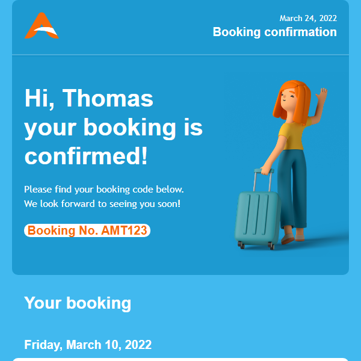
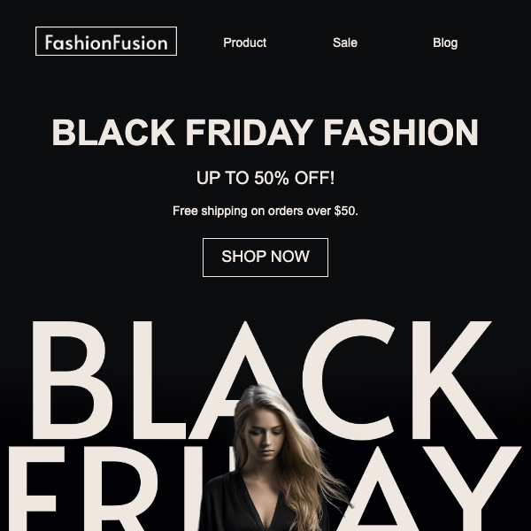
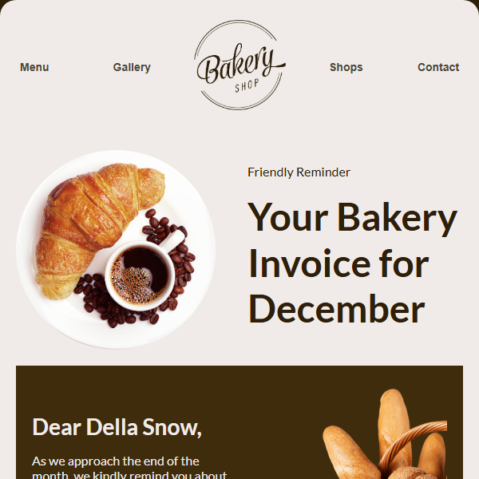
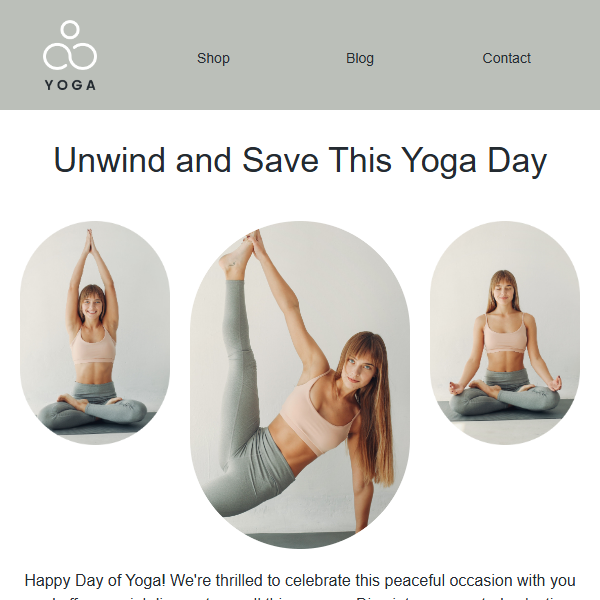

# Email Templates Collection

A comprehensive collection of responsive HTML email templates for various occasions and business needs.

## 📧 Template Gallery

### 🌱 Agriculture & Environment
<table>
<tr>
<td width="50%">
<h4>Agriculture Newsletter</h4>

</td>
<td width="50%">
<h4>Environment Day</h4>

</td>
</tr>
</table>

### ✈️ Travel & Transportation
<table>
<tr>
<td width="50%">
<h4>Airline Ticket</h4>

</td>
<td width="50%">
<h4>Holiday Booking</h4>

</td>
</tr>
<tr>
<td width="50%">
<h4>World Tourism Day</h4>

</td>
<td width="50%">
<h4>Car Insurance</h4>

</td>
</tr>
</table>

### 🎓 Education & Back to School
<table>
<tr>
<td width="50%">
<h4>Back to School</h4>

</td>
<td width="50%">
<h4>Lunchbox Recipes & Tips</h4>

</td>
</tr>
<tr>
<td width="50%">
<h4>Teachers Day Sale</h4>

</td>
<td width="50%">
</td>
</tr>
</table>

### 🛍️ E-commerce & Sales
<table>
<tr>
<td width="50%">
<h4>Black Friday Sale</h4>

</td>
<td width="50%">
<h4>One Day Sale</h4>

</td>
</tr>
<tr>
<td width="50%">
<h4>Christmas Sale</h4>

</td>
<td width="50%">
<h4>Furniture Sale</h4>

</td>
</tr>
<tr>
<td width="50%">
<h4>Jewelry Sale</h4>

</td>
<td width="50%">
<h4>Running Shoes</h4>

</td>
</tr>
</table>

### 🍰 Food & Beverages
<table>
<tr>
<td width="50%">
<h4>Bakery Template</h4>

</td>
<td width="50%">
<h4>Food Festival</h4>

</td>
</tr>
<tr>
<td width="50%">
<h4>Vegan Day</h4>

</td>
<td width="50%">
</td>
</tr>
</table>

### 🎉 Celebrations & Events
<table>
<tr>
<td width="50%">
<h4>Birthday E-Voucher</h4>

</td>
<td width="50%">
<h4>Father's Day</h4>

</td>
</tr>
<tr>
<td width="50%">
<h4>Halloween Party</h4>

</td>
<td width="50%">
<h4>Wedding</h4>

</td>
</tr>
</table>

### 💄 Beauty & Wellness
<table>
<tr>
<td width="50%">
<h4>Flower Makeup</h4>

</td>
<td width="50%">
<h4>Fit Balance</h4>

</td>
</tr>
<tr>
<td width="50%">
<h4>Yoga Day</h4>

</td>
<td width="50%">
</td>
</tr>
</table>

### 🎬 Entertainment
<table>
<tr>
<td width="50%">
<h4>Cine Mania</h4>

</td>
<td width="50%">
</td>
</tr>
</table>

### 🏥 Health & Awareness
<table>
<tr>
<td width="50%">
<h4>Cancer Survivors Day</h4>

</td>
<td width="50%">
</td>
</tr>
</table>

### 🏗️ Business & Services
<table>
<tr>
<td width="50%">
<h4>Construction</h4>

</td>
<td width="50%">
<h4>SaaS Email</h4>

</td>
</tr>
</table>

### 📦 E-commerce Operations
<table>
<tr>
<td width="50%">
<h4>Delivery Details</h4>

</td>
<td width="50%">
<h4>Order Promotion</h4>

</td>
</tr>
</table>

### 🎁 Gift Cards & Vouchers
<table>
<tr>
<td width="50%">
<h4>E-Gift Card</h4>

</td>
<td width="50%">
</td>
</tr>
</table>

### 👶 Kids & Family
<table>
<tr>
<td width="50%">
<h4>Kids Goods</h4>

</td>
<td width="50%">
</td>
</tr>
</table>

### 🔐 Account & Security
<table>
<tr>
<td width="50%">
<h4>Password Reset</h4>

</td>
<td width="50%">
<h4>Verify Account</h4>

</td>
</tr>
<tr>
<td width="50%">
<h4>Welcome to Application</h4>

</td>
<td width="50%">
<h4>Subscription Expiring</h4>

</td>
</tr>
<tr>
<td width="50%">
<h4>Transaction Failed</h4>

</td>
<td width="50%">
</td>
</tr>
</table>

## 🛠️ Features

- **Responsive Design**: All templates are mobile-friendly and work across email clients
- **Easy Customization**: Simple HTML structure for quick modifications
- **High-Quality Images**: Professional images and graphics included
- **Cross-Client Compatible**: Tested with major email providers
- **Ready to Use**: Templates are production-ready

## 📁 Project Structure

Each template folder contains:
- `*.html` - The main email template file
- `assets/` - Images and resources used in the template
- `email_full.png` - Full-size preview image
- `email_thumb.png` - Thumbnail preview image

## 🚀 Usage

1. Choose a template from the gallery above
2. Navigate to the template folder
3. Open the HTML file and customize content, colors, and images as needed
4. Test the template in your email client or ESP (Email Service Provider)

## 🔧 Screenshot Generation

Use the included screenshot generator script to create preview images:

```bash
cd scripts
python3 gen.py
```

The script automatically generates both full-size and thumbnail preview images for any template.

## 📄 License

This project is open source and available under the [MIT License](LICENSE).