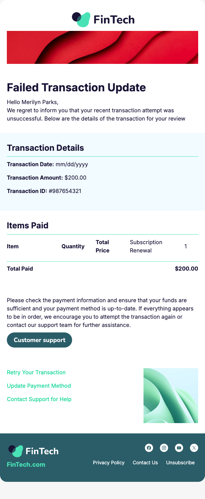

# Transaction Fail Update

simple and informative template to notify users about failed transactions provide clear reasons suggest corrective actions and ensure smooth continuation of their services

  

